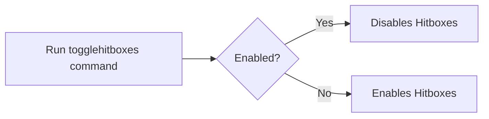

# Debug In Commands

***

As you expect it, the mod translates <b>some</b> debug shortcuts into executable commands. 
This mod is intended to be paired with Wynncraft for 1.18.2 users.

<h2>Features</h2>
<h3>Toggle Hitboxes</h3>

><b>Syntax</b>: /togglehitboxes, /hitboxes, /th

